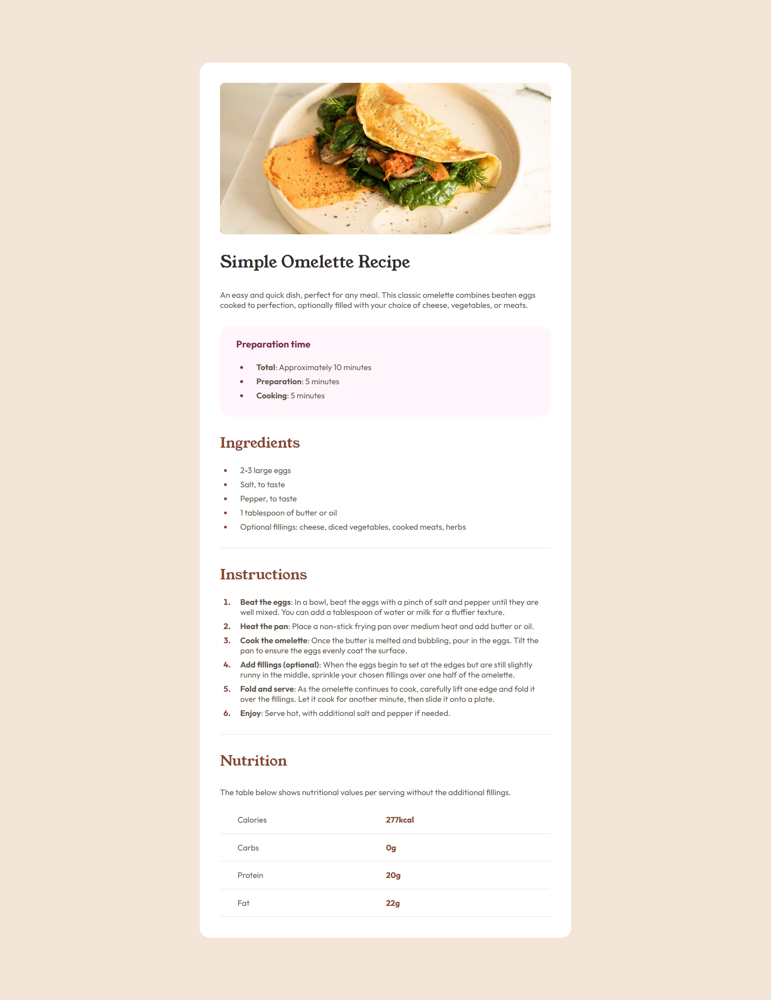

# Frontend Mentor - Recipe page solution

This is a solution to the [Recipe page challenge on Frontend Mentor](https://www.frontendmentor.io/challenges/recipe-page-KiTsR8QQKm). Frontend Mentor challenges help you improve your coding skills by building realistic projects.

## Table of contents

- [Overview](#overview)
  - [The challenge](#the-challenge)
  - [Screenshot](#screenshot)
  - [Links](#links)
- [My process](#my-process)
  - [Built with](#built-with)
- [Author](#author)

## Overview

### The challenge

Users should be able to:

- See hover and focus states for all interactive elements on the page

### Screenshot

### Links

- [Solution URL](https://github.com/sergioguri00/frontendmentor/tree/main/recipe-page)
- [Live Site URL](https://sergioguri00.github.io/frontendmentor/recipe-page/)

### Built with

- Semantic HTML5 markup
- CSS custom properties

## Author

- [My Github profile](https://github.com/sergioguri00)
- Frontend Mentor - [@sergioguri00](https://www.frontendmentor.io/profile/sergioguri00)
